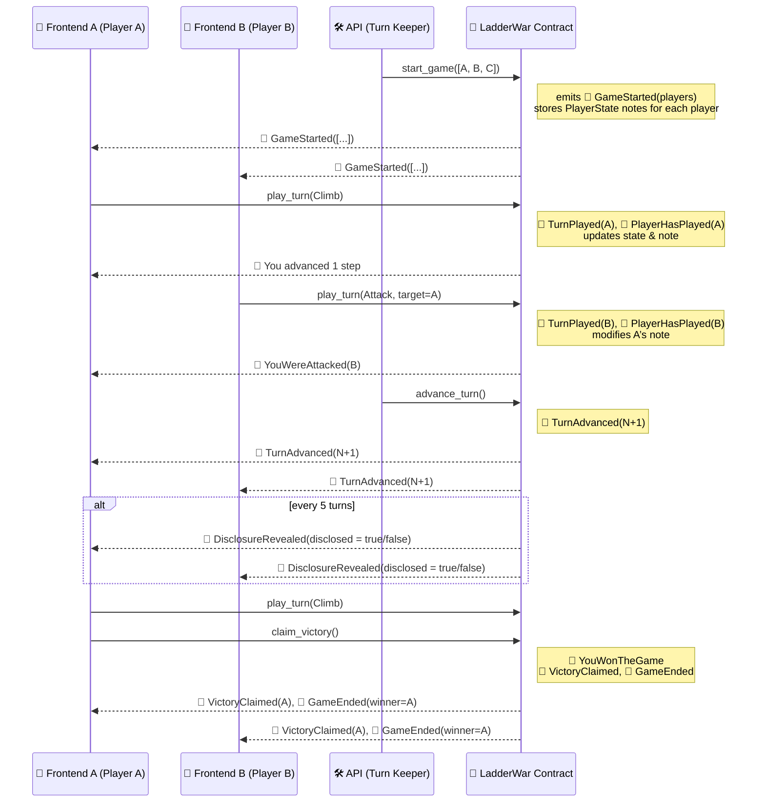

# 🧱 Ladder War — A Privacy-Preserving ZK Game on Aztec

**Ladder War** is a zero-knowledge strategy game where three prisoners compete to escape a high-security facility.  
They each climb their own ladder toward a helicopter waiting at the top — but only one makes it out.

This game is built on **Aztec's private smart contract layer**, leveraging encrypted notes, private state, and selective disclosures.  
Players interact through `play_turn` actions that remain private, while key events are selectively revealed on-chain.

---

## 🎮 Gameplay Overview

- Each game consists of **three players** starting at step 0.
- On each turn, a player can either:
  - 🪜 **Climb** their ladder one step, or
  - 🪓 **Sabotage** an opponent, knocking them down one step.
- The state of other players remains **fully private**, except for periodic **disclosures every 5 turns**.
- The first player to reach step 20 may claim victory — but they must **prove** it with a valid private proof.
- A backend **Turn Keeper API** helps coordinate turn advancement and triggers the periodic disclosures.

This repo includes:
- 🧠 A Noir-based smart contract (`LadderWar`) implementing the full game logic
- ⚙️ An API service for managing turns and disclosures
- 🕹 A React frontend that lets each player connect, choose a character, and play their moves privately

### 🔍 Strategic Disclosure Every 5 Turns

Ladder War introduces a **partial information mechanic** designed to balance privacy with strategic tension.

Every 5 turns, the contract emits a `DisclosureRevealed` event, which publicly reveals **whether any player is currently within the last 5 steps** of the ladder (steps 15 to 19), but **does not disclose who**. This adds pressure and encourages tactical moves like sabotage or acceleration.

#### Example:
At Turn 10:
- `📣 DisclosureRevealed { turn: 10, disclosed: true }`
- This tells all players that **someone is getting close to victory**, but not who.
- It raises the stakes, potentially triggering attacks or desperate climbs.

This mechanic enhances game theory:
- **Players must infer** who is likely to be near the top.
- Encourages **risk-based decisions** without sacrificing full privacy.

Only upon a valid victory claim is the winner’s identity publicly revealed via:
- `📣 VictoryClaimed { player }`
- `📣 GameEnded { winner }`

This mechanism helps maintain suspense and balances information asymmetry while leveraging the privacy guarantees of Aztec.

## 📋 Functions and Associated Events

| **Function**                    | **Event**                                        | **Type**     |
|---------------------------------|--------------------------------------------------|--------------|
| 🔒 `start_game(players)`        | `GameStarted { players: [AztecAddress; 3] }`     | 📣 Public     |
|                                 | Emission of `Note<PlayerState>` per player       | 🔐 Private    |
|                                 |                                                  |              |
| 🔒 `play_turn(action, target?)` | `PlayerHasPlayed { player, turn }`               | 📣 Public     |
|                                 | `TurnPlayed { player, action, target? }`         | 🔐 Private    |
|                                 | `YouWereAttacked { attacker, turn }`             | 🔐 Private    |
|                                 |                                                  |              |
| 🔒 `claim_victory()`            | `VictoryClaimed { player }`                      | 📣 Public     |
|                                 | `GameEnded { winner }`                           | 📣 Public     |
|                                 | `YouWonTheGame { turn, position }`               | 🔐 Private    |
|                                 |                                                  |              |
| 🔓 `advance_turn()`             | `TurnAdvanced { new_turn }`                      | 📣 Public     |
|                                 | `DisclosureRevealed { turn, disclosed }`         | 📣 Public     |
|                                 |                                                  |              |
| 🔓 `get_current_turn()`         | —                                                | —             |
| 🔓 `get_disclosure_flag()`      | —                                                | —             |
| 🔓 `get_winner()`               | —                                                | —             |

---

### 🔍 Legend

- 🔒 = Private function  
- 🔓 = Public function  
- 📣 = Public event (via `encode_event`)  
- 🔐 = Private event (via `encode_and_encrypt_event`)

## Sequence Diagram

