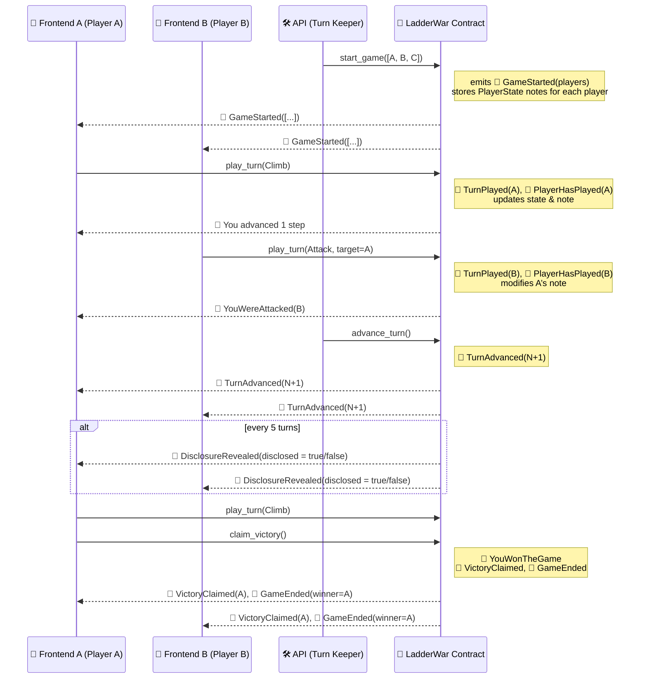

## 📋 Functions and Associated Events

| **Function**                    | **Event**                                        | **Type**     |
|---------------------------------|--------------------------------------------------|--------------|
| 🔒 `start_game(players)`        | `GameStarted { players: [AztecAddress; 3] }`     | 📣 Public     |
|                                 | Emission of `Note<PlayerState>` per player       | 🔐 Private    |
|                                 |                                                  |              |
| 🔒 `play_turn(action, target?)` | `PlayerHasPlayed { player, turn }`               | 📣 Public     |
|                                 | `TurnPlayed { player, action, target? }`         | 🔐 Private    |
|                                 | `YouWereAttacked { attacker, turn }`             | 🔐 Private    |
|                                 |                                                  |              |
| 🔒 `claim_victory()`            | `VictoryClaimed { player }`                      | 📣 Public     |
|                                 | `GameEnded { winner }`                           | 📣 Public     |
|                                 | `YouWonTheGame { turn, position }`               | 🔐 Private    |
|                                 |                                                  |              |
| 🔓 `advance_turn()`             | `TurnAdvanced { new_turn }`                      | 📣 Public     |
|                                 | `DisclosureRevealed { turn, disclosed }`         | 📣 Public     |
|                                 |                                                  |              |
| 🔓 `get_current_turn()`         | —                                                | —             |
| 🔓 `get_disclosure_flag()`      | —                                                | —             |
| 🔓 `get_winner()`               | —                                                | —             |

---

### 🔍 Legend

- 🔒 = Private function  
- 🔓 = Public function  
- 📣 = Public event (via `encode_event`)  
- 🔐 = Private event (via `encode_and_encrypt_event`)

## Sequence Diagram

